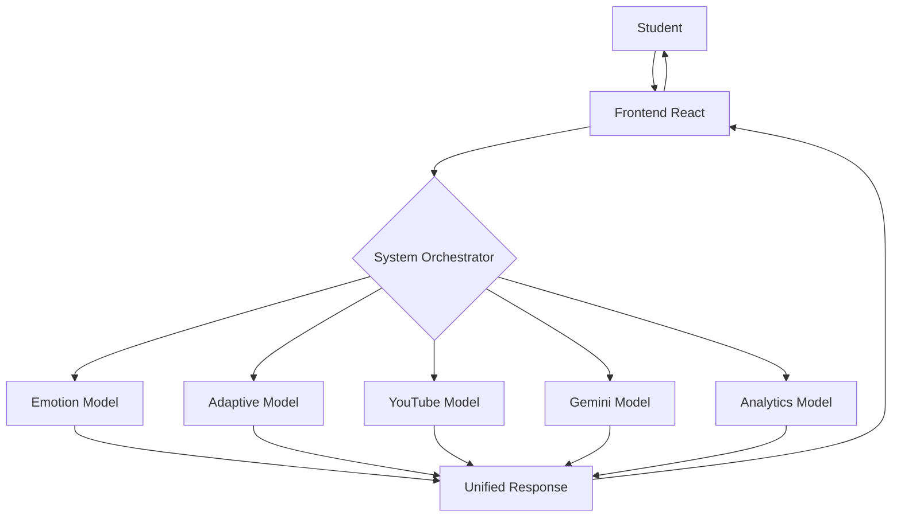

# 🎓 ADAPTO - Adaptive E-Learning System for Kids

> An intelligent, AI-powered adaptive learning platform for children (ages 6-12) featuring personalized YouTube-based educational content, emotion-aware delivery, and comprehensive analytics.

## ✨ Key Features

### 🤖 AI-Powered Learning System
- **5 Independent AI Modules** coordinated by System Orchestrator
- **YouTube Recommendation Model** - Child-safe video selection
- **Gemini AI Intelligence** - Explanations, quizzes, motivation
- **Adaptive Decision Engine** - Rule-based personalization
- **Analytics Engine** - Parent/teacher insights

### 🎬 YouTube-Based Content
- **6 Subjects** (Alphabets, Numbers, Colors, Shapes, Plants, Flowers)
- **54 Child-Safe Videos** (9 videos per subject)
- **3 Difficulty Levels** (Easy, Medium, Hard)
- **3 Content Styles** (Standard, Fun, Easy Explanation)
- Auto-unlock quiz when video ends

### 🧠 Adaptive Difficulty System
| Quiz Score | Next Level | AI Support |
|------------|------------|------------|
| > 80% | Hard | None |
| ≥ 50% | Medium | None |
| < 50% | Easy | Explanation + Motivation |

### 😊 Emotion-Aware Content
| Detected Emotion | Content Style |
|------------------|---------------|
| Bored | Fun & Engaging |
| Confused | Easy Explanation |
| Happy/Focused | Standard |

### 📊 Complete Analytics
- **Parent Dashboard** - Child progress tracking
- **Teacher Dashboard** - Class performance insights
- **Weak Topic Identification** - < 60% average score
- **Level Progression Charts**
- **Emotion Usage Statistics**

### 🔄 Live Data Cloud Sync
- **Real-time Synchronization** - Progress saves instantly to the cloud.
- **Cross-Platform** - Login from any device and see the same progress.
- **Teacher-Parent Parity** - Parents and Teachers see the exact same live data.

### 🌐 Multiple Language Support
- **Bilingual Interface** - Full support for **English** and **Hindi**.
- **Instant Toggle** - Switch languages instantly without reloading.
- **Culturally Relevant** - Content adapted for diverse learners.

### 👆 Touch-Based Learning
- **Kid-Frienigation and engagement.

### � Voice & Text-to-Speech
- **AI Voice Narration** - Listen to explanations and content
- **gTTS Integration** - Natural-sounding text-to-speech
- **Accessibility Support** - Audio learning for all children
- **Multi-language TTS** - Voice support for English and Hindi

### �📄 AI-Generated PDF Reports
- **One-Click Generation** - Teachers can download detailed PDF reports.
- **AI Summaries** - Googledly UI** - Large buttons and interactive elements designed for small hands.
- **Tablet Optimized** - Perfect for iPad and Android learning tablets.
- **Gesture Support** - Easy nav Gemini writes a personalized qualitative assessment.
- **Visual Charts** - Includes graphs of student performance trends.

---

> 📘 **For a deep dive into the architecture and how these features work, read the [Technical Overview](./TECHNICAL_OVERVIEW.md).**

---

## 🏗️ System Architecture



### Modular AI Architecture
All AI modules are **independent and reusable**:
1. **YouTube Recommendation Model** - Fetches child-safe educational videos
2. **Gemini AI Intelligence Layer** - Provides explanations and motivation
3. **Adaptive Decision Model** - Rules-based central brain
4. **Analytics Model** - Generates parent/teacher insights
5. **System Orchestrator** - Coordinates all modules

---

## 🛠️ Tech Stack

| Layer | Technologies |
|-------|--------------|
| **Frontend** | React 18, Vite, Tailwind CSS, Framer Motion, YouTube IFrame API |
| **Backend** | Python Flask, RESTful API |
| **Database** | MongoDB (Local or Atlas) |
| **AI/ML** | YouTube Data API v3, Google Gemini AI |
| **Analytics** | Chart.js, Statistical Aggregation |
| **State** | React Context API, localStorage |

---

## 🚀 Quick Start

### Prerequisites
- Node.js 18+
- Python 3.9+
- MongoDB (local or Atlas)
- YouTube API Key ([Get Here](https://console.cloud.google.com/apis/library/youtube.googleapis.com))
- Gemini API Key ([Get Here](https://makersuite.google.com/app/apikey))

## 🎯 Quick Setup (Recommended for Clients)

We've created automated setup scripts for easy installation:

### Windows Users
```bash
# Run the automated setup script
setup-windows.bat
```

### Mac/Linux Users
```bash
# Make the script executable
chmod +x setup-unix.sh

# Run the automated setup script
./setup-unix.sh
```

### Verify Installation
After setup, verify everything is working:
```bash
cd backend
python verify_setup.py
```

> [!TIP]
> For detailed step-by-step instructions, see [SETUP_GUIDE.md](./SETUP_GUIDE.md)

---

## 📖 Manual Setup Instructions

### 1. Clone Repository
```bash
git clone https://github.com/road2tec/Adaptive-E-Learning-Platform.git
cd "Adaptive E-Learning System for Kids"
```

### 2. Backend Setup
```bash
cd backend
python -m venv venv
venv\Scripts\activate          # Windows
source venv/bin/activate       # Mac/Linux
pip install -r requirements.txt

# Create .env file
copy .env.example .env         # Windows
cp .env.example .env           # Mac/Linux

# Edit .env with your API keys
python app.py
```
Backend runs at: `http://localhost:5612`

### 3. Frontend Setup
```bash
cd frontend
npm install
npm run dev
```
Frontend runs at: `http://localhost:5173`

### 4. Environment Variables
Edit `backend/.env`:
```env
MONGO_URI=mongodb://localhost:27017/adaptive_learning
YOUTUBE_API_KEY=your_youtube_api_key_here
GEMINI_API_KEY=your_gemini_api_key_here
PORT=5612
```

✅ **See [DEPLOYMENT_GUIDE.md](./DEPLOYMENT_GUIDE.md) for complete setup instructions**

---

## 📚 API Endpoints

### System Orchestrator (Main)
```
POST /api/learning/next-step      - Complete adaptive learning flow
GET  /api/learning/progress/:id   - Student analytics (Teacher view)
GET  /api/users/my-progress       - Current user's live progress (Student/Parent view)
```

### Individual Modules
```
POST /api/youtube/videos          - Get YouTube videos
POST /api/gemini/explain          - Get topic explanation
POST /api/gemini/motivate         - Get motivation message
POST /api/adaptive/decide         - Get adaptive decision
POST /api/voice/speak             - Generate text-to-speech audio
GET  /api/analytics/parent/:id    - Parent analytics
GET  /api/analytics/teacher       - Teacher analytics
```

**Complete API Documentation:**
- [YouTube API](./backend/models/YOUTUBE_API_DOCS.md)
- [Gemini API](./backend/models/GEMINI_API_DOCS.md)
- [Adaptive Model](./backend/models/ADAPTIVE_MODEL_DOCS.md)
- [Analytics](./backend/models/ANALYTICS_DOCS.md)
- [Orchestrator](./backend/controllers/ORCHESTRATOR_DOCS.md)

---

## 🎯 Learning Flow

```
1. Student watches YouTube video (auto-detects when video ends)
2. Selects emotion (Happy, Bored, Confused, Focused)
3. Takes mandatory 5-question quiz
4. System Orchestrator coordinates:
   ├── Emotion Detection
   ├── Adaptive Decision (next level, content type)
   ├── YouTube Recommendations (new videos)
   ├── Gemini AI Support (if needed)
   └── Analytics Update
5. Shows results with star rating
6. Recommends next lesson
```

---

## 📁 Project Structure

```
Adaptive E-Learning System for Kids/
├── frontend/                   # React + Vite
│   ├── src/
│   │   ├── components/        # Reusable UI components
│   │   ├── context/           # Auth & Learning Context
│   │   ├── pages/             # Page components
│   │   │   ├── Login.jsx
│   │   │   ├── Dashboard.jsx
│   │   │   ├── LessonDetail.jsx
│   │   │   ├── Quiz.jsx
│   │   │   ├── Result.jsx
│   │   │   ├── ParentDashboard.jsx
│   │   │   ├── TeacherDashboard.jsx
│   │   │   ├── TeacherStudents.jsx
│   │   │   ├── TeacherMaterials.jsx
│   │   │   └── TeacherQuizzes.jsx
│   │   └── mockData.js        # 6 subjects, 54 videos
│   └── package.json
│
├── backend/                    # Flask API
│   ├── models/                # AI Models
│   │   ├── youtube_model.py   # Video recommendations
│   │   ├── gemini_model.py    # AI intelligence
│   │   ├── adaptive_model.py  # Decision engine
│   │   └── analytics_model.py # Data insights
│   ├── controllers/
│   │   └── orchestrator.py    # System coordinator
│   ├── routes/                # API endpoints
│   ├── .env.example           # Environment template
│   └── requirements.txt
│
├── README.md                   # This file
├── DEPLOYMENT_GUIDE.md         # Complete deployment guide
└── PROJECT_DOCUMENTATION.md    # Technical documentation
```

---

## 🎨 Design System

- **Theme**: Premium Illustrated Kids UI
- **Colors**: Soft pastels (pink, lavender, sky blue, mint green)
- **Cards**: Glassmorphism with blur effects
- **Typography**: Nunito & Quicksand fonts
- **Animations**: Floating decorations, smooth transitions
- **Icons**: Emoji-based for child-friendliness

---

## 📖 Available Content

| Subject | Topics | Videos | Quiz Questions |
|---------|--------|--------|----------------|
| 🍎 Alphabets | A for Apple | 9 | 5 |
| 🔢 Numbers | Counting 1-10 | 9 | 5 |
| 🌈 Colors | Rainbow Colors | 9 | 5 |
| 🔷 Shapes | Basic Shapes | 9 | 5 |
| 🌱 Plants | Plants Around Us | 9 | 5 |
| 🌸 Flowers | Beautiful Flowers | 9 | 5 |

**Total:** 54 child-safe YouTube videos, 30 quiz questions

---

## 🔐 User Roles

### Kid Account
- Access lessons and watch videos
- Take mandatory quizzes
- Earn stars (1-5 based on score)
- Track personal progress

### Parent Account
- View child's learning analytics
- See quiz scores and trends
- Monitor level progression
- Review emotion-based content usage

### Teacher Account
- **Dashboard Overhaul**: Premium glassmorphism UI with a floating, animated sidebar.
- **Student Directory**: Monitor all students' stars, progress, and difficulty levels.
- **Material Hub**: Add and manage YouTube-based study materials with search/filter.
- **Quiz Factory**: Design and launch custom 5-question quizzes for any subject.
- **Class Insights**: Identify weak topics and track overall class performance.

---

## 🧪 Demo Accounts

### Student Login
```
Email: leo@example.com
Password: password123
```

### Parent Login
```
Email: parent@example.com
Password: password123
```

---

## 📊 Analytics & Insights

### Parent Analytics
- Quiz scores (last 10)
- Level progression per subject
- Pass/retry statistics
- Emotion usage distribution
- Overall summary (lessons, avg score, stars)

### Teacher Analytics
- Student performance distribution
- Topic-wise average scores
- Weak topics (<60% avg)
- Difficulty distribution
- Class summary statistics

---

## 🎓 Educational Approach

### Why Rule-Based Adaptive Logic?
- ✅ **Transparent** - Parents/teachers understand decisions
- ✅ **Explainable** - No "black box" AI
- ✅ **Reliable** - Consistent behavior
- ✅ **Safe** - Predictable for children

### Dummy Emotion Model
Current emotion detection is **rule-based** for prototype:
- High score (>80%) → Happy
- Medium score (50-80%) → Neutral
- Low score (30-50%) → Confused
- Very low (<30%) → Frustrated

**Future Enhancement:** Replace with real computer vision-based emotion detection.

---

## 🚀 Deployment

### Local Development
See [DEPLOYMENT_GUIDE.md](./DEPLOYMENT_GUIDE.md) for step-by-step instructions.

### Cloud Deployment (Optional)
- **Backend:** Render, Railway, AWS EC2
- **Frontend:** Vercel, Netlify
- **Database:** MongoDB Atlas
- **Environment Variables:** Set via cloud platform dashboard

---

## 📝 Documentation

- [Deployment Guide](./DEPLOYMENT_GUIDE.md) - Complete setup instructions
- [Project Documentation](./PROJECT_DOCUMENTATION.md) - Technical details
- [YouTube API Docs](./backend/models/YOUTUBE_API_DOCS.md)
- [Gemini API Docs](./backend/models/GEMINI_API_DOCS.md)
- [Adaptive Model Docs](./backend/models/ADAPTIVE_MODEL_DOCS.md)
- [Analytics Docs](./backend/models/ANALYTICS_DOCS.md)
- [Orchestrator Docs](./backend/controllers/ORCHESTRATOR_DOCS.md)

---

## 🔒 Security & Best Practices

- ✅ API keys stored in `.env` (never committed)
- ✅ Child-safe content (`safeSearch=strict`)
- ✅ Environment variable validation
- ✅ Error handling with fallbacks
- ✅ MongoDB authentication for production
- ✅ CORS properly configured

---

## 🐛 Common Issues & Solutions

See [DEPLOYMENT_GUIDE.md - Common Errors](./DEPLOYMENT_GUIDE.md#common-errors--fixes)

---

## 📈 Future Enhancements

- [ ] Real emotion detection using computer vision
- [ ] More subjects (Science, Math, Geography)
- [ ] Voice-based quiz answering
- [ ] Multiplayer learning games
- [ ] Certificate generation
- [ ] Mobile app (React Native)

---

## 🤝 Contributing

Contributions are welcome! Please read our contributing guidelines before submitting PRs.

---

## 📄 License

This project is licensed under the MIT License - see the [LICENSE](LICENSE) file for details.

---

## 👏 Acknowledgments

- YouTube Data API v3 for educational video discovery
- Google Gemini AI for intelligent learning assistance
- All educators who provided feedback on adaptive learning

---

## ✨ This system is deployment-ready and scalable.

**Made with ❤️ for young learners**

**Star ⭐ this repo if you find it helpful!**
