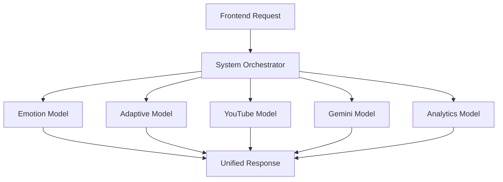

# System Orchestrator - Documentation

## Overview
The **System Orchestrator** is the central coordinator that integrates all independent AI models into a unified adaptive learning workflow.

---

## Purpose

**Single Entry Point** for the complete learning journey:
```
Emotion → Quiz → Adaptive Decision → YouTube → Gemini → Analytics
```

### Why Orchestration Layer?

1. **Separation of Concerns** - Each model handles one task
2. **Modularity** - Models can be swapped independently  
3. **Maintainability** - Single place to understand flow
4. **Scalability** - Easy to add new models
5. **Testing** - Test models in isolation

---

## Architecture



---

## API Endpoints

### 1. Main Orchestrator
**POST** `/api/learning/next-step`

Get complete personalized learning recommendation.

**Request:**
```json
{
  "user_id": "user123",
  "subject": "Alphabets",
  "topic": "A for Apple",
  "quiz_score": 85,
  "current_level": "Easy",
  "emotion": "happy"
}
```

**Response:**
```json
{
  "success": true,
  "next_level": "Hard",
  "content_type": "Standard",
  "youtube_videos": [
    {
      "videoId": "abc123",
      "title": "Advanced Alphabets",
      "thumbnail": "...",
      "embedUrl": "..."
    }
  ],
  "gemini_explanation": null,
  "gemini_motivation": null,
  "adaptive_reasoning": {
    "emotion_detected": "happy",
    "quiz_score": 85,
    "decision_explanation": "Score 85% shows mastery → Moving to Hard level"
  }
}
```

---

### 2. Progress Tracking
**GET** `/api/learning/progress/:userId`

Get student's complete analytics.

---

### 3. Flow Information
**GET** `/api/learning/flow-info`

Get documentation of the orchestrated workflow.

---

## Workflow Steps

### Step 1: Emotion Detection
- **Model:** Emotion Model (dummy)
- **Action:** Detect student's emotional state
- **Output:** "happy" | "bored" | "confused" | "frustrated"

### Step 2: Adaptive Decision
- **Model:** Adaptive Decision Model
- **Input:** Emotion + Quiz Score + Current Level
- **Output:** Next Level + Content Type + AI Support Flags

### Step 3: YouTube Recommendation
- **Model:** YouTube Model
- **Input:** Subject + Topic + Level + Content Type
- **Output:** 3 child-safe educational videos

### Step 4: Gemini AI Support (Conditional)
- **Model:** Gemini Model
- **Triggers:**
  - Explanation: If student confused or score <50%
  - Motivation: If score <50%
- **Output:** Child-friendly text

### Step 5: Unified Response
- **Orchestrator:** Combines all outputs
- **Returns:** Complete learning recommendation

---

## Implementation Files

| File | Purpose |
|------|---------|
| `backend/controllers/orchestrator.py` | Core orchestration logic |
| `backend/routes/learning_routes.py` | REST API endpoints |

---

## Integration Example

```python
# Frontend calls
POST /api/learning/next-step
{
  "user_id": "leo123",
  "subject": "Plants",
  "topic": "Plants Around Us",
  "quiz_score": 45,
  "current_level": "Easy"
}

# Orchestrator coordinates:
1. Emotion: detect_emotion(45) → "confused"
2. Decision: make_adaptive_decision("confused", 45, "Easy")
   → {next_level: "Easy", content_type: "Explanation", 
      require_gemini_explanation: true, 
      require_gemini_motivation: true}
3. YouTube: get_youtube_recommendations("Plants", "Plants Around Us", "Easy", "Explanation")
   → [3 simple plant explanation videos]
4. Gemini: generate_gemini_response("Plants", "Plants Around Us", "explanation")
   → "Plants are living things that grow from seeds..."
5. Gemini: generate_gemini_response("Plants", "Plants Around Us", "motivation")
   → "Don't worry! Learning takes practice. You're doing great! 🌱"

# Returns complete package to frontend
```

---

## Error Handling

**Graceful Degradation:**
- If YouTube API fails → Return empty videos array
- If Gemini API fails → Skip explanation/motivation
- If Adaptive Model fails → Use fallback (keep same level)
- **Learning flow NEVER breaks**

**Fallback Response:**
```json
{
  "success": false,
  "fallback": true,
  "next_level": "Easy",
  "content_type": "Standard",
  "youtube_videos": [],
  "gemini_motivation": "Keep trying! 🌟"
}
```

---

## Future Enhancements

1. **Real Emotion Detection**
   - Replace dummy with CV model
   - Facial expression analysis
   - Engagement metrics

2. **Batch Processing**
   - Process multiple students
   - Class-wide recommendations
   - Performance optimization

3. **Caching**
   - Cache YouTube results
   - Cache Gemini responses
   - Reduce API calls

4. **A/B Testing**
   - Test different recommendation strategies
   - Measure learning outcomes
   - Optimize adaptive logic

---

## Benefits of Orchestration

✅ **Modular** - Each model is independent  
✅ **Testable** - Test components separately  
✅ **Scalable** - Add new models easily  
✅ **Maintainable** - Single source of truth  
✅ **Resilient** - Never breaks learning flow

---

**This orchestrator enables modular AI integration and future expansion.**
